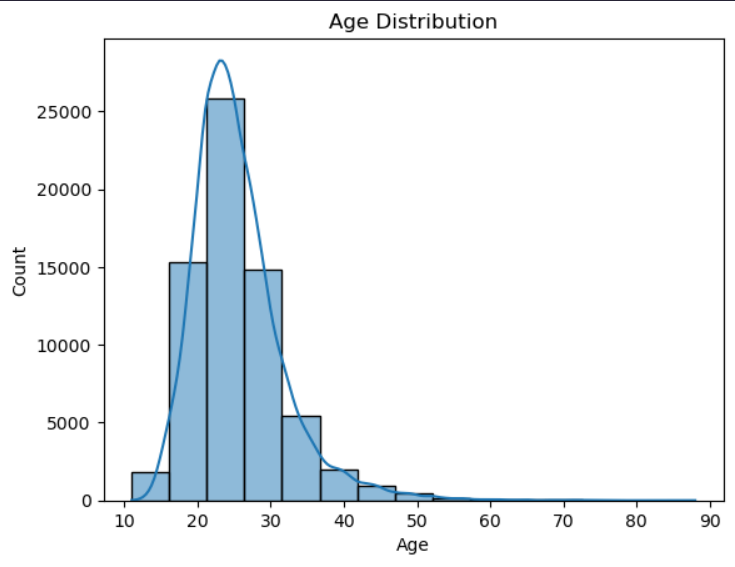

# EDA_Olympics_Data_Analysis

## Introduction
In this project, this is focused on the process of **Exploratory Data Analysis (EDA)** from a data on Olympics from around 
the world that is given with *dataset_olympics.csv*. This project is guided by a YouTube Channel: [Onur Baltaci](https://www.youtube.com/watch?v=wQ9wMv6y9qc&ab_channel=OnurBaltac%C4%B1), for gaining 
insight on the process of EDA in this project as a beginner level.

## Tech Stack 
1. Visual Studio Code
2. Jupyter Notebook
3. Python (Pandas, Matplotlib, & Seaborn)

## Features
Throughout of the EDA process, we investigate our dataset for duplicate and missing values, describe a statistical analysis of the whole dataset, and queries for 
creating our data visualizations of our findings. 

## Process
I worked on this project guided by Onur Baltaci to gain some experience in EDA process, so we initialize our dataFrame by reading our given 
CSV file, *dataset_olympics.csv*, so we can start looking at the basic information such as column information, statistical analysis. Then, we 
start checking for duplicate and missing values, so the data is cleaned before we start making our queries for our data visualizations. 
We made a lots of distribution based on athletes' gender, age, height, and weight that were participated in the past Olympics. We also created
data visuals on Olympic medals (gold, silver & bronze), and see which ten countries have the highest and lowest amount of participants over the years in the Olympics.

## Learning
What I learn from this project is how to make queries for our data visualizations. It helps develop skills on building queries, and ways to make data visuals since there 
can be more than one way to make different kinds of visuals, such as violin plot since I was never taught how to use or make a violin plot. 

## Improvement
The two visualization I had struggled was the x-axis label for *Number of Unique Events per Sport*, and values on a heatmap of *Medal Counts by Country and Year*. 
Onur Baltaci wanted to see what of those two different graphs looked like, but the problem is that not every values and variables cannot fit into one graph. It is 
difficult for the audience to read our data visualization. I think I would reduce the number of data values or variables, so it can reduce of complexity in our graph and 
easier to read for our audience. 

## Running the project
You can download the *olympics.ipynb* file, and run it on either Jupyter Notebook, Visual Studio
Code (require Jupyter Notebook extension), and Google Colab. 

